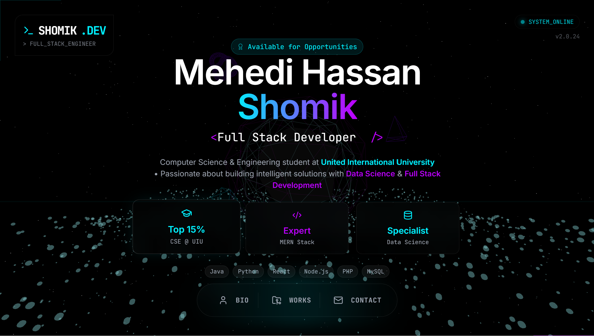

# 3D Immersive Portfolio



A hyper-modern, immersive 3D web portfolio built for **Mehedi Hassan Shomik**, a Computer Science Engineer & Full Stack Developer. This project features a stunning interactive particle system, diverse 3D elements, and a sleek cyberpunk/sci-fi aesthetic with glassmorphism UI.

## 🚀 Features

- ** immersive 3D Background**: A dynamic particle network simulated with `Three.js` and `Maath` that reacts to mouse movement.
- **Floating HUD Navigation**: A futuristic Heads-Up Display for seamless navigation between sections (`<Bio />`, `<Works />`, `{Contact}`).
- **Interactive Hero Section**: Features a typing effect, personal stats, and an animated journey timeline.
- **Glassmorphism UI**: Premium frosted glass effects using Tailwind CSS and backdrop filters.
- **Smooth Animations**: Powered by `Framer Motion` for buttery-smooth page transitions and element entrances.
- **Cyberpunk Aesthetic**: Neon cyan and electric purple color palette with a dark void background.
- **Responsive Design**: Fully optimized for diverse screen sizes.

## 🛠️ Tech Stack

- **Framework**: [React](https://react.dev/) + [Vite](https://vitejs.dev/)
- **3D Graphics**: [Three.js](https://threejs.org/), [@react-three/fiber](https://docs.pmnd.rs/react-three-fiber), [@react-three/drei](https://github.com/pmndrs/drei)
- **Styling**: [Tailwind CSS](https://tailwindcss.com/)
- **Animations**: [Framer Motion](https://www.framer.com/motion/)
- **Icons**: [Lucide React](https://lucide.dev/)
- **Math/Physics**: [Maath](https://github.com/pmndrs/maath)

<<<<<<< HEAD
If you are developing a production application, we recommend using TypeScript with type-aware lint rules enabled. Check out the [TS template](https://github.com/vitejs/vite/tree/main/packages/create-vite/template-react-ts) for information on how to integrate TypeScript and [`typescript-eslint`](https://typescript-eslint.io) in your project.
>>>>>>> 59ee658 (Almost Done)
=======
## 📦 Installation & Setup

1. **Clone the repository**
   ```bash
   git clone https://github.com/yourusername/3d-portfolio.git
   cd 3d-portfolio
   ```

2. **Install dependencies**
   ```bash
   npm install
   ```

3. **Run the development server**
   ```bash
   npm run dev
   ```

4. **Build for production**
   ```bash
   npm run build
   ```

## 📂 Project Structure

```
src/
├── components/
│   ├── CameraController.jsx  # Handles 3D camera transitions
│   ├── Hero.jsx              # Main landing section with stats & timeline
│   ├── HUD.jsx               # Heads-Up Display navigation
│   ├── Loader.jsx            # Cyberpunk boot sequence loader
│   ├── OverlayContent.jsx    # Modal content for Bio, Works, Contact
│   └── ParticleNetwork.jsx   # Interactive 3D background system
├── App.jsx                   # Main application entry
├── index.css                 # Global styles & Tailwind directives
└── main.jsx                  # React DOM root
```

## 🎨 Color Palette

- **Void Black**: `#050505`
- **Neon Cyan**: `#00F0FF`
- **Electric Purple**: `#BD00FF`

## 📄 License

This project is licensed under the MIT License - see the [LICENSE](LICENSE) file for details.

---

Designed & Developed by **Mehedi Hassan Shomik**
>>>>>>> cafbcf5 (Created Readme.md)
